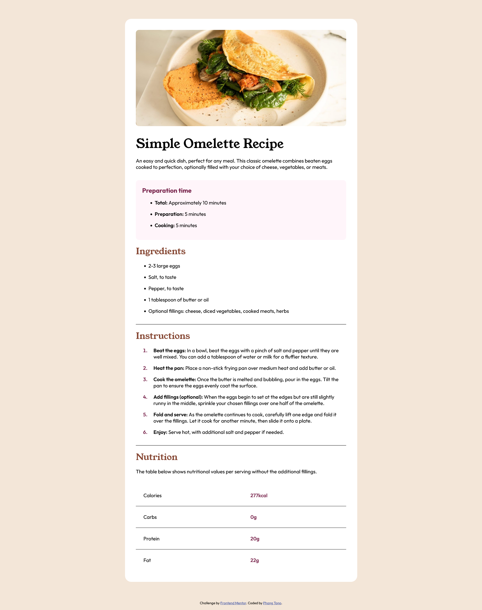

# Frontend Mentor - Recipe page solution

This is a solution to the [Recipe page challenge on Frontend Mentor](https://www.frontendmentor.io/challenges/recipe-page-KiTsR8QQKm). Frontend Mentor challenges help you improve your coding skills by building realistic projects. 

## Table of contents

- [Overview](#overview)
  - [The challenge](#the-challenge)
  - [Screenshot](#screenshot)
  - [Links](#links)
- [My process](#my-process)
  - [Built with](#built-with)
  - [What I learned](#what-i-learned)
  - [Useful resources](#useful-resources)
- [Author](#author)

## Overview

### The challenge

My challenge is to build out this recipe page and get it looking as close to the design as possible.

### Screenshot



### Links

- Solution URL: [recipe-page-code](https://github.com/phangtono/recipe-page)
- Live Site URL: [recipe-page-live-site](https://courageous-cat-e432d3.netlify.app/)

## My process

### Built with

- HTML5
- CSS
- pseudo-element
- pseudo-class

### What I learned

I use max-width, min-width (to limit the maximum and minimum width allowed) to make it responsive. and so that it is always in the middle I use margin: auto.

```css
.wrapper{
    max-width: 740px;
    min-width: 375px;
    width: 100%;
    margin: 60px auto;
    background-color: var(--clr-neutral-white);
    padding: 35px;
    border-radius: 20px;
}
```

What's interesting here is that I use a pseudo-element (::marker) to provide color and thickness for the numbering. for spacing, I added padding-left.

```css
ol li {
    padding-left: 1rem;
}
ol li::marker{
    font-weight: 600;
    color: var(--clr-primary-dark-raspberry);
}
```

in the last part, for the lines, I used a table with border-collapse: collapse, and each row, column was given a line that, except for the last row: tr:last-child, for each row in the second column, I gave it a thickness and color style. (td:nth-child(2))

```css
table{
    width: 100%;
    border-collapse: collapse;
}
td{
    border-bottom: 1px solid black;
    padding: 1.5rem ;
}
tr:last-child td{
    border-bottom: 0;
}
td:nth-child(2) {
    font-weight: 600;
    color: var(--clr-primary-dark-raspberry);
}
```

### Useful resources

- [How to create and style lists with HTML and CSS](https://www.youtube.com/watch?v=bRYwmmLC_Ns&t=1s) - This helped me custom style list in <ol>

## Author
- Frontend Mentor - [@phangtono](https://www.frontendmentor.io/profile/phangtono)
